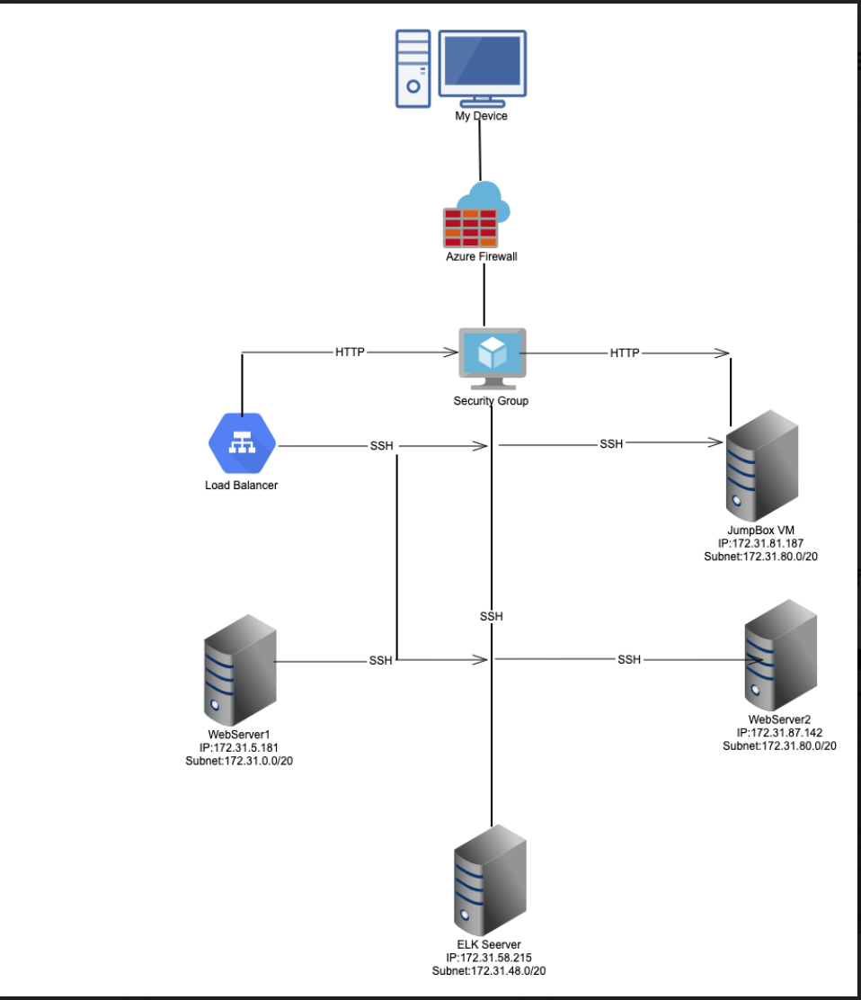

Automated ELK Stack Deployment

The files in this repository were used to configure the network depicted below.

These files have been tested and used to generate a live ELK deployment on Azure. They can be used to either recreate the entire deployment pictured above. Alternatively, select portions of the playbook file may be used to install only certain pieces of it, such as Filebeat.

-[filebeat-playbook.yml](Ben file name for filebeat-playbook.yml]ELK install](elk-install.yml)[MetricBeat](metricbeat-playbook.yml0)[hosts](hosts.txt)

This document contains the following details:
- Description of the Topologu
- Access Policies
- ELK Configuration
  - Beats in Use
  - Machines Being Monitored
- How to Use the Ansible Build

Description of the Topology

The main purpose of this network is to expose a load-balanced and monitored instance of DVWA, the D*mn Vulnerable Web Application.

Load balancing ensures that the application will be highly accessible,redundant orreliable in addition to restricting access to the network. Load balancers protects the system from DDos attacks by shifting attack traffic. The advantage of a jumpbox is to give access to the user from a single node that can be secured and monitored.

-What aspect of security do load balancers protect? 
What is the advantage of a jump box?
Load balancers protects the system from DDos attacks by shifting attack traffic. The advantage of a jumpbox is to give access to the user from a single node that can be secured and monitored.
Integrating an ELK server allows users to easily monitor the vulnerable VMs for changes to the log and system traffic.

- What does Filebeat watch for?
Filebeat is a lightweight shipper for forwarding and centralizing log data,Filebeat monitors the log files or locations that you specify, collects log events, and forwards them either to Elasticsearch or Logstash for indexing.

-What does Metricbeat record?
Metricbeat takes the metrics and statistics that it collects and ships them to the output that you specify, such as Elasticsearch or Logstash. Metricbeat helps to monitor the servers by collecting metrics from the system and services running on the server, such as: Apache.

The configuration details of the machine can be found below the table.

| Name    | Function    | IP Address     | Operating System           |
|---------|-------------|----------------|----------------------------|
| Jump Box| Gateway     | 172.31.81.187  | Linux/UNIX                 |
| Web1    | Server      | 172.31.5.181   | Linux/UNIX                 |
| Web2    | Server      | 172.31.87.142  | Linux/UNIX                 |
| ELK     | Server      | 172.31.58.215 | Linux(Ubuntu Version 20.04) |

 Access Policies

The machines on the internal network are not exposed to the public Internet. 

Only thejumpbox machine can accept connections from the Internet. Access to this machine is only allowed from the following IP addresses:
3.223.125.253 

Machines within the network can only be accessed byeach other.

- Which machine did you allow to access your ELK VM? 
- Web1,Web2,Web3 will send traffic to the ELK Server
- What was its IP address?_

A summary of the access policies in place can be found in the table below.

| Name       | Publicly Accessible | Allowed IP Addresses |
|------------|---------------------|----------------------|
| Jump Box   | Yes                 | 172.31.81.187        |
| Web1       | NO                  | 172.31.81.187        |
|  Web1      | NO                  | 172.31.81.187        |
|  Web1      | NO                  | 172.31.81.187        |
| ELK Server | YES                 | 172.31.81.187        |

Elk Configuration

Ansible was used to automate configuration of the ELK machine. No configuration was performed manually, which is advantageous because using the configuration can berepeated automatically as new machines are added. If updates needs to be made the changes can take place in one file and then run to the individual machines.
- What is the main advantage of automating configuration with Ansible?

The playbook implements the following tasks:
-In 3-5 bullets, explain the steps of the ELK installation play. E.g., install Docker; download image; etc.

 docker Install.

 Install: ELK

Install: docker python module

Install: python3-pip-

The following screenshot displays the result of running docker ps after successfully configuring the ELK instance.

Update the path with the name of your screenshot of docker ps output](Images/docker_ps_output.png)

Target Machines & Beats

This ELK server is configured to monitor the following machines:
-  List the IP addresses of the machines you are monitoring
-  172.31.5.181
-  172.31.87.142 

We have installed the following Beats on these machines: Web1 and Web2

These Beats allow us to collect the following information from each machine:
- Metricbeat: Detects  changes in filesystem metrics as CPU usage SSH login attempts , failed sudo escalations and CPU/RAM.
- Filebeat: Detects changes to the filesystem and collects Apache logs

Using the Playbook

In order to use the playbook, you will need to have an Ansible control node already configured. Assuming you have such a control node provisioned: 

SSH into the control node and follow the steps below:
- Copy the playbook file to/etc/ansible.
- Update the configuration file for each beat to include the ELK server host information.
- Run the playbook, and navigate to http://3.142.35.241:5601/app/kibana#/home to check that the installation worked as expected.

